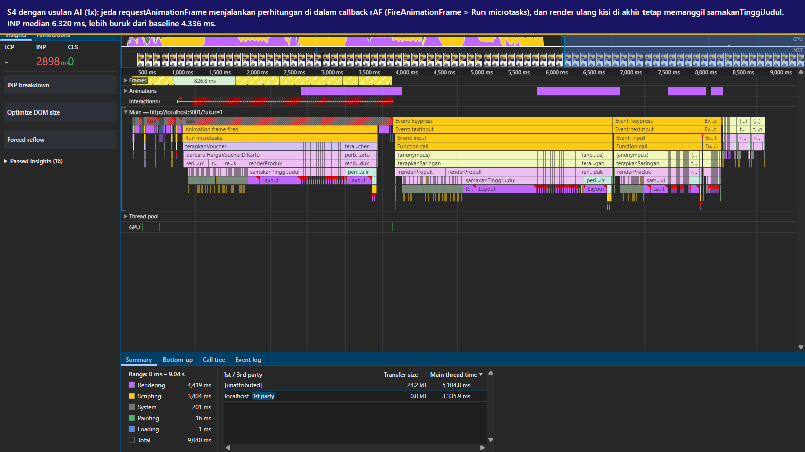
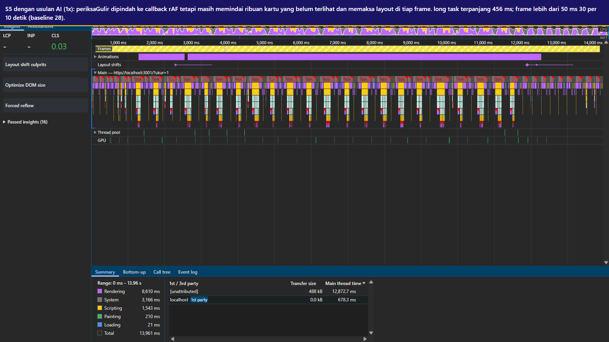
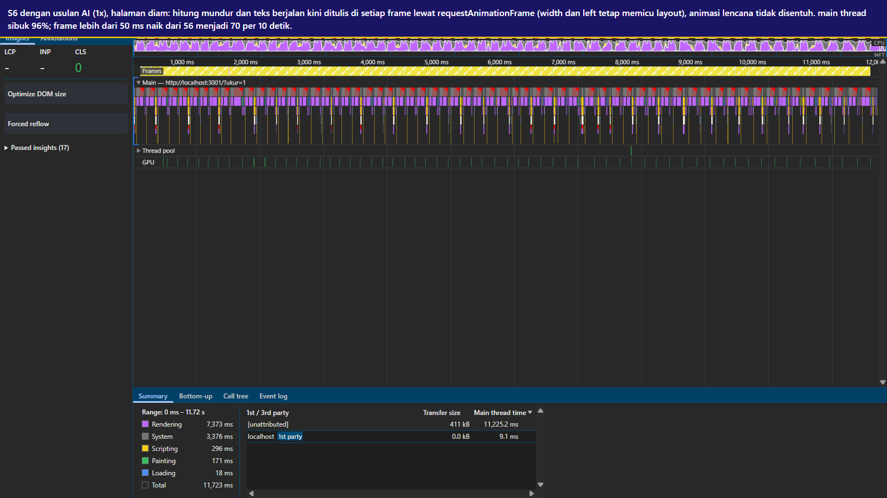

# audit usulan perbaikan dari AI

alat AI yang dipakai: agen coding berbasis model Claude Sonnet, dijalankan di worktree git terpisah dari kode awal (commit e1846ac). agen hanya diberi teks tiga tiket, aturan main (berkas terlarang, tanpa library, fitur tidak boleh dihapus), dan akses ke kode; agen tidak diberi trace dan tidak menjalankan browser.

branch atau commit tempat usulan diterapkan: branch usulan-ai, commit 9e1813f (TK-1057), 3b9da0b (TK-1063), 83930fc (TK-1070).

cara uji: protokol yang sama dengan pengukuran utama (laporan/bench/ukur-cdp.js, 1x, viewport 412 x 915, median 3 kali, satu trace per skenario). hasil di laporan/hasil/ai-1x.json dan laporan/trace/ai-1x-*.json.gz, dibandingkan dengan baseline laporan/hasil/sebelum-1x.json.

| skenario | metrik | baseline | usulan AI | perbaikan tim (akhir-1x) |
|---|---|---|---|---|
| S4 | INP | 4.336 ms | 6.320 ms | 24 ms |
| S4 | long task terlama | 3.470 ms | 3.944 ms | 0 |
| S4 | frame yang menampilkan progres | 0 | 2 | 5 |
| S4 | toast voucher muncul setelah klik | 8.943 ms | 7.477 ms | 1.664 ms |
| S5 | frame > 50 ms per 10 dtk | 28 | 30 | 0 |
| S5 | long task terlama | 346 ms | 356 ms | 0 |
| S6 | frame > 50 ms per 10 dtk | 56 | 70 | 0 |
| S6 | jumlah long task | 57 | 71 | 0 |

---

## A-01: voucher tetap membeku, INP malah naik

- tiket yang diminta diperbaiki: TK-1057
- prompt yang diberikan (ringkas): teks tiket TK-1057, TK-1063, TK-1070 apa adanya, ditambah aturan main dari TUGAS.md bagian 5, lalu "perbaiki di kode, commit satu commit per tiket, laporkan diagnosis dan perubahan".
- usulan AI (ringkas): diagnosisnya benar sebagian: fungsi async tanpa await hanya menghasilkan microtask, dan 40 panggilan simulasiCicilan yang hasilnya dibuang dihapus. sebagai jeda, AI menambahkan "if (performance.now() - terakhirJeda > 16) { await new Promise(requestAnimationFrame); ... }" di dalam loop, sementara await hitungHargaPromo per produk dan render ulang kisi di akhir dibiarkan.
- jenis masalah pada usulan:
  - [ ] salah diagnosis (memperbaiki hal yang bukan penyebab)
  - [x] tidak lengkap (gejala berkurang tetapi akar masalah masih ada)
  - [x] menimbulkan regresi (metrik lain, fitur, aksesibilitas, atau memori memburuk)
  - [ ] melanggar aturan main (menghapus fitur, mengubah berkas terlarang, dan sebagainya)
  - [ ] memperbaiki sesuatu yang tidak berpengaruh terukur
- bukti: INP S4 naik dari 4.336 ms menjadi 6.320 ms, long task terlama dari 3.470 ms menjadi 3.944 ms; progres hanya tampil di 2 frame. di trace ai-1x-s4 (gambar/fc-ai-s4.png) perhitungan berjalan di bawah "Animation frame fired > Run microtasks > terapkanVoucher", dan perbaruiHargaVoucherDiKartu masih memakan 2.578 ms total dengan samakanTinggiJudul 3.996 ms total selama skenario.

- mengapa AI bisa keliru di sini: dari kode, jeda requestAnimationFrame terlihat seperti "memberi browser kesempatan menggambar". di trace terlihat lanjutan await dijalankan sebagai microtask di dalam callback rAF, yaitu tepat sebelum frame itu digambar, sehingga pekerjaan hingga 16 ms justru menempel ke frame. AI juga tidak bisa melihat bahwa beban terbesar S4 bukan perhitungan (sekitar 40 ms setelah baris 40x dihapus) melainkan render ulang kisi dan layout paksa di akhir dan saat mengetik; itu hanya terlihat di call tree trace.
- perbaikan yang benar menurut tim: potongan berbatas waktu yang menyerahkan kendali lewat scheduler.yield() atau setTimeout(0), sehingga tiap potongan adalah task baru (P-03), ditambah render kisi bertahap tanpa layout paksa (P-05). hasil: INP S4 24 ms, progres tampil di 5 frame.

---

## A-02: listener wheel dijadikan passive, tetapi guliran tidak membaik

- tiket yang diminta diperbaiki: TK-1063
- prompt yang diberikan (ringkas): sama dengan A-01.
- usulan AI (ringkas): periksaGulir dibungkus requestAnimationFrame (paling banyak sekali per frame), wheel dan scroll diubah menjadi passive, dan pemindaian dibatasi ke document.querySelectorAll('.kartu:not(.terlihat)'). AI menyebut listener wheel non-passive sebagai "penyebab utama gulir terasa patah-patah". touchmove tetap passive: false untuk mencegah pull-to-refresh, dan animasi margin-top kartu tidak diubah.
- jenis masalah pada usulan:
  - [ ] salah diagnosis (memperbaiki hal yang bukan penyebab)
  - [x] tidak lengkap (gejala berkurang tetapi akar masalah masih ada)
  - [ ] menimbulkan regresi (metrik lain, fitur, aksesibilitas, atau memori memburuk)
  - [ ] melanggar aturan main (menghapus fitur, mengubah berkas terlarang, dan sebagainya)
  - [x] memperbaiki sesuatu yang tidak berpengaruh terukur
- bukti: frame lebih dari 50 ms S5 28 menjadi 30, long task terlama 346 ms menjadi 356 ms; keduanya dalam rentang variasi antarputaran, jadi tidak ada perbaikan terukur. di trace ai-1x-s5 (gambar/fc-ai-s5.png), periksaGulir masih memakan 3.496 ms total (baseline 3.967 ms) dan long task terpanjang 456 ms berisi callback rAF periksaGulir dengan layout paksa.

- mengapa AI bisa keliru di sini: listener non-passive adalah penyebab jank yang paling sering dibahas, jadi dari kode ia tampak seperti jawaban. trace menunjukkan waktu habis di getBoundingClientRect dan layout untuk ribuan kartu yang belum terlihat (hampir semua kartu belum terlihat saat menggulir di awal), dan di penulisan minHeight di sela pembacaan. mengurangi frekuensi pemanggilan ke sekali per frame tidak menolong bila satu panggilan sudah lebih lama dari satu frame. listener touchmove non-passive yang tersisa juga tetap menahan guliran di perangkat sentuh.
- perbaikan yang benar menurut tim: IntersectionObserver untuk kartu muncul dan impresi, overscroll-behavior pengganti touchmove, bar progres dengan transform, efek muncul dengan transform dan opacity (P-07), ditambah DOM yang jauh lebih kecil dari render bertahap (P-05). hasil: frame lebih dari 50 ms S5 0 pada 1x.

---

## A-03: timer diganti requestAnimationFrame, beban saat diam justru naik

- tiket yang diminta diperbaiki: TK-1070
- prompt yang diberikan (ringkas): sama dengan A-01.
- usulan AI (ringkas): kedua setInterval 10 ms di promo.js diganti loop requestAnimationFrame; lebar elemen dibaca sekali lalu disimpan. tiap frame tetap menulis empat teks hitung mundur, garis.style.width, dan teks.style.left. CSS lencana (animasi top dan box-shadow) tidak disentuh.
- jenis masalah pada usulan:
  - [x] salah diagnosis (memperbaiki hal yang bukan penyebab)
  - [ ] tidak lengkap (gejala berkurang tetapi akar masalah masih ada)
  - [x] menimbulkan regresi (metrik lain, fitur, aksesibilitas, atau memori memburuk)
  - [ ] melanggar aturan main (menghapus fitur, mengubah berkas terlarang, dan sebagainya)
  - [ ] memperbaiki sesuatu yang tidak berpengaruh terukur
- bukti: frame lebih dari 50 ms S6 naik dari 56 menjadi 70 per 10 detik, jumlah long task dari 57 menjadi 71; main thread tetap sibuk 96% (trace ai-1x-s6, gambar/fc-ai-s6.png). di trace yang sama, layout 3.095 ms dan PrePaint 3.872 ms masih mendominasi. selain itu kecepatan teks berjalan kini bergantung pada refresh rate layar (1 px per frame, jadi 60 px per detik di layar 60 Hz), padahal rancangan awal 100 px per detik.

- mengapa AI bisa keliru di sini: dari kode, setInterval 10 ms terbaca "100 kali per detik". di trace baseline, TimerFire hanya sekitar 10 per detik karena tiap callback lebih lama dari intervalnya; loop rAF malah berjalan sekitar 60 kali per detik, masing-masing dengan penulisan width dan left yang memicu layout. sumber PrePaint terbesar, animasi top dan box-shadow pada lencana, ada di CSS dan tidak tersentuh karena AI hanya melihat JavaScript.
- perbaikan yang benar menurut tim: hitung mundur ditulis sekali per detik dan angka perseratus detik digerakkan animasi CSS, teks berjalan dengan @keyframes transform, lencana dengan transform dan opacity, animasi lencana di luar layar dijeda (P-08). hasil: frame lebih dari 50 ms S6 0 dan main thread sibuk 15% pada 1x.

---

## catatan usulan AI yang benar

dua bagian diagnosis AI sesuai dengan temuan tim: fungsi async tanpa await tidak memberi kesempatan render, dan 40 panggilan simulasiCicilan yang hasilnya dibuang boleh dihapus tanpa mengubah aturan bisnis. keduanya juga dipakai di P-03. yang kurang adalah bukti besarnya biaya tiap bagian, sehingga prioritasnya meleset.

## refleksi

AI paling membantu untuk membaca kode dengan cepat dan menyebut kandidat mekanisme: microtask tanpa jeda render, listener non-passive, timer berfrekuensi tinggi. ketiganya memang ada di kode. masalahnya, AI memperlakukan kandidat itu sebagai penyebab utama tanpa mengukur berapa besar kontribusinya, jadi usulannya menyentuh bagian yang benar-benar ada tetapi bukan bagian yang paling mahal. di tugas ini, bagian paling mahal (render ulang kisi, layout paksa di samakanTinggiJudul dan periksaGulir, animasi CSS lencana) hanya terlihat jelas di call tree dan bottom-up trace. kewaspadaan paling tinggi diperlukan saat AI menyebut suatu perubahan "penyebab utama": klaim itu perlu dicek dengan trace sebelum dan sesudah, karena di A-02 perubahannya tidak berefek dan di A-03 perubahan yang tampak masuk akal justru menambah beban.
