# laporan audit performa dan interaksi TokoKilat

tim: ....

anggota: ....

tanggal: 25-09-2026

panjang maksimal setara 6 halaman (tidak termasuk lampiran gambar).

## 1. ringkasan eksekutif

halaman flash sale tidak lambat karena server. saat pengguna hanya melihat-lihat pun, main thread browser sudah sibuk 96% oleh timer 10 ms dan animasi, sehingga ketikan, ketukan, dan guliran harus mengantre. di laptop kami, versi awal tidak bisa diukur sama sekali pada simulasi ponsel lambat (CPU 4x): halaman belum siap setelah 120 detik. setelah 22 commit perbaikan kecil tanpa menulis ulang aplikasi, respons ketikan di kolom cari turun dari 6 detik menjadi 16 ms, pesanan ganda dari tiga ketukan hilang (3 menjadi 1), perhitungan voucher tidak lagi membekukan layar, halaman tidak lagi melompat saat banner muncul (CLS 0,137 menjadi 0), dan permintaan gambar saat halaman dibuka turun dari 3.000 menjadi 8. pada simulasi ponsel lambat, semua target tercapai kecuali dua: guliran masih punya 5 frame lambat per 10 detik (target paling banyak 2), dan main thread saat diam masih sibuk 55%, sebagian besar oleh alat ukur itu sendiri (lihat T-09).

## 2. lingkungan pengukuran

- laptop: AMD Ryzen 5 7535HS (12 thread), RAM 23 GB, tersambung listrik; Windows 11; Chrome 153.0.8010.53.
- data: npm start (3.000 produk).
- cara ukur: laporan/bench/ukur-cdp.js menjalankan skenario S0 sampai S6 lewat Chrome DevTools Protocol dengan profil Chrome baru tanpa ekstensi (setara Incognito), viewport 412 x 915, pemuatan pertama lalu muat ulang, tiap skenario 3 kali, dilaporkan median. INP, CLS, long task, dan frame lebih dari 50 ms dihitung dengan aturan yang sama dengan public/alat/ukur.js. tiap skenario juga direkam sekali sebagai trace (laporan/trace/, bisa dibuka di panel Performance). data mentah ada di laporan/hasil/.
- penyimpangan dari protokol: pada 4x, halaman awal belum juga siap setelah 120 detik, baik dengan 3.000 produk maupun dengan npm run start:ringan (1.500 produk). trace S6 menunjukkan main thread sudah sibuk 96% tanpa throttling, jadi pada 4x tidak ada waktu kosong. karena itu perbandingan sebelum dan sesudah dilakukan pada 1x (tanpa throttling) di mesin dan konfigurasi yang sama, lalu hasil akhir juga diukur pada 4x untuk dicocokkan dengan target.
- video demo: laporan/video/demo.mp4 (93 detik, CPU 4x, viewport 412 x 915, direkam dengan laporan/bench/rekam-demo.js lewat screencast CDP). bagian sebelum memakai kode awal: selama 47 detik hanya 36 frame tergambar, hitung mundur berhenti di angka yang sama, kisi tetap "Memuat produk…", dan ketikan tidak tampil. bagian sesudah menunjukkan S1 sampai S5 pada kode akhir.
- catatan variasi: pada 4x, hasil antarsesi pengukuran bisa bergeser cukup jauh. contohnya INP S1 88 ms di laporan/hasil/p11-4x.json dan 32 ms di laporan/hasil/akhir-4x.json, padahal kode S1 di antara kedua pengukuran itu tidak berubah. angka 4x di bawah dibaca sebagai kisaran, bukan angka pasti.

## 3. hasil sebelum dan sesudah

| skenario | metrik | sebelum (1x) | sesudah (1x) | sesudah (4x) | target | tercapai? |
|---|---|---|---|---|---|---|
| S0 | CLS | 0,137 | 0 | 0 | <= 0,1 | ya |
| S0 | permintaan gambar dalam 10 dtk pertama | 3.000 (322 selesai) | 8 (8 selesai) | 8 | sebanding dengan yang terlihat | ya |
| S0 | gambar terakhir selesai | detik ke-94,7 | detik ke-0,4 | detik ke-0,4 | - | - |
| S1 | INP | 6.032 ms | 16 ms | 32 ms | <= 200 ms | ya |
| S1 | long task terlama | 4.949 ms | 0 | 54 ms | <= 100 ms | ya |
| S2 | INP | 200 ms | 16 ms | 48 ms | <= 200 ms | ya |
| S2 | long task terlama | 146 ms | 0 | 0 | <= 100 ms | ya |
| S3 | jumlah pesanan dari 3 klik | 3 | 1 | 1 | 1 | ya |
| S3 | INP | 288 ms | di bawah 16 ms | 32 ms | <= 200 ms | ya |
| S4 | INP | 4.336 ms | 24 ms | 88 ms | <= 200 ms | ya |
| S4 | frame yang menampilkan progres | 0 | 5 | 4 | tergambar bertahap | ya |
| S4 | long task terlama | 3.470 ms | 0 | 53 ms | <= 100 ms | ya |
| S5 | frame > 50 ms per 10 dtk | 28 | 0 | 5 | <= 2 | 1x ya, 4x tidak |
| S5 | long task terlama | 346 ms | 0 | 53 ms | <= 100 ms | ya |
| S6 | frame > 50 ms per 10 dtk | 56 | 0 | 0 | <= 2 | ya |
| S6 | main thread sibuk (trace) | 96% | 15% | 55% | mendekati nol | sebagian |

sumber: laporan/hasil/sebelum-1x.json, akhir-1x.json, akhir-4x.json. INP 1x yang ditulis "di bawah 16 ms" berarti tidak ada interaksi yang melewati ambang Event Timing 16 ms.

## 4. temuan

temuan diurutkan dari dampak terbesar. nomor P-xx merujuk ke laporan/PREDIKSI.md, tempat prediksi, alternatif, dan hasil tiap perbaikan dicatat lengkap.

### T-01: halaman diam memenuhi main thread

- tiket terkait: TK-1070, juga memperparah TK-1063, TK-1044, dan semua tiket lain.
- gejala bagi pengguna: ponsel panas dan baterai cepat habis saat hanya melihat-lihat; semua interaksi lain terasa lambat.
- bukti: trace sebelum-1x-s6 (gambar/fc-s6-sebelum.png): main thread sibuk 11.273 ms dari 11.700 ms; layout 3.406 ms, PrePaint 3.223 ms, dan dua callback setInterval di promo.js masing-masing sekitar 935 ms. TimerFire hanya 10 per detik walau interval diminta 10 ms, karena tiap task timer lebih lama dari intervalnya.

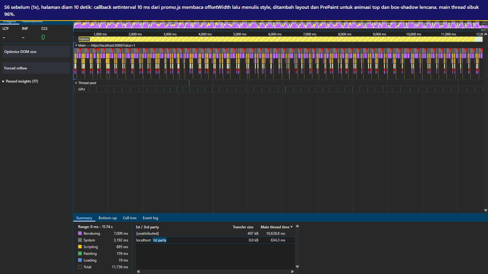

- akar masalah dan mekanismenya: promo.js menjalankan dua setInterval 10 ms. hitung mundur menulis teks lalu membaca offsetWidth (layout paksa) dan menulis width; teks berjalan membaca offsetWidth dan menulis left. .lencana-kilat menganimasikan top dan box-shadow, yang menurut artikel web.dev tentang animasi berperforma tinggi tidak bisa dijalankan compositor, jadi tiap frame butuh style, layout, dan paint di main thread.
- kualitas yang terdampak: performance efficiency (resource utilization: CPU terpakai terus walau tidak ada interaksi; capacity: tidak ada sisa waktu untuk input). interaction capability (user engagement: ponsel panas membuat pengguna berhenti; operability: interaksi lain antre di belakang timer).
- perbaikan (P-08): hitung mundur ditulis sekali per detik; angka perseratus detik berupa strip 99 sampai 00 yang digeser animasi CSS steps(100) dan disamakan dengan waktu sekali per detik; teks berjalan memakai @keyframes transform; lencana memakai transform dan opacity lewat ::after; animasi lencana dijeda saat kartunya di luar layar.
- trade-off: angka perseratus detik tidak lagi dibacakan pembaca layar (strip diberi aria-hidden); alternatif tetap menulis dari JavaScript per frame lebih akurat tetapi membuat main thread bekerja tiap frame.
- hasil: frame lebih dari 50 ms S6 56 menjadi 0; main thread sibuk 96% menjadi 15% (1x). sisa beban terutama berasal dari requestAnimationFrame di alat ukur: tanpa ?ukur=1, halaman diam hanya memakai sekitar 55 ms per 5 detik pada 1x (gambar/fc-s6-sesudah.png).

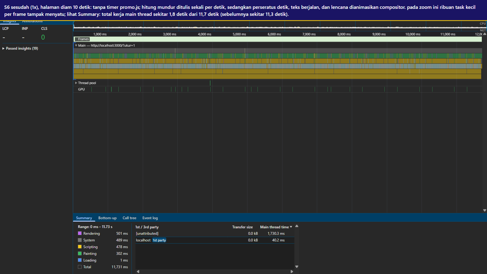

### T-02: pencarian merender ulang ribuan kartu dan memaksa layout berulang

- tiket terkait: TK-1041 (S1), juga render akhir TK-1057.
- gejala bagi pengguna: huruf muncul terlambat, halaman seperti hang saat mengetik.
- bukti: trace sebelum-1x-s1 (gambar/fc-s1-sebelum.png): satu ketikan menjadi task 5,3 detik; renderProduk 11.125 ms total selama S1, samakanTinggiJudul 6.033 ms self, formatRupiah 1.145 ms self, dan 365 layout paksa (5.446 ms).

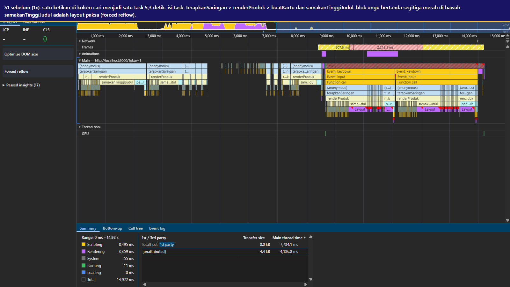

- akar masalah dan mekanismenya: tiap huruf menghapus kisi lalu membuat ulang semua kartu yang cocok (huruf "s" cocok dengan 2.897 produk). samakanTinggiJudul menulis tinggi lalu membaca offsetHeight bergantian, sehingga setiap pembacaan memaksa layout sinkron seluruh kisi (layout thrashing). formatRupiah membangun Intl.NumberFormat baru di tiap panggilan (4.335 kali per render penuh; microbenchmark: sekitar 310 ms dibanding 5 ms bila dipakai ulang).
- kualitas yang terdampak: performance efficiency (time behaviour: INP 6 detik). interaction capability (operability: kolom cari praktis tidak bisa dipakai; self-descriptiveness: huruf yang tidak muncul membuat pengguna ragu ketikannya diterima; user engagement: pelanggan pindah ke toko lain seperti di tiket).
- perbaikan: satu Intl.NumberFormat (P-04); render bertahap per 16 kartu dengan sentinel IntersectionObserver dan pemakaian ulang elemen kartu (P-05, P-11); samakanTinggiJudul dihapus; debounce 150 ms dan teks cari dinormalkan sekali per produk (P-06).
- trade-off: perataan judul pertama dibuat dengan CSS subgrid, tetapi pengukuran 4x menunjukkan subgrid membuat perubahan teks di satu kartu me-layout seluruh kisi (sekitar 52 ms untuk 200 kartu, dibanding 3 sampai 5 ms tanpa subgrid). subgrid diganti kartu flex dengan judul minimal tiga baris (P-11), sehingga judul lebih dari tiga baris membuat harga di kartu itu tidak sejajar dengan tetangganya. render bertahap juga berarti Ctrl+F browser hanya menemukan produk yang sudah dirender, sedangkan pencarian di kolom cari tetap mencakup semua produk.
- hasil: INP S1 6.032 ms menjadi 16 ms (1x) dan 32 ms (4x); long task terlama 4.949 ms menjadi 0 (1x) dan 54 ms (4x).

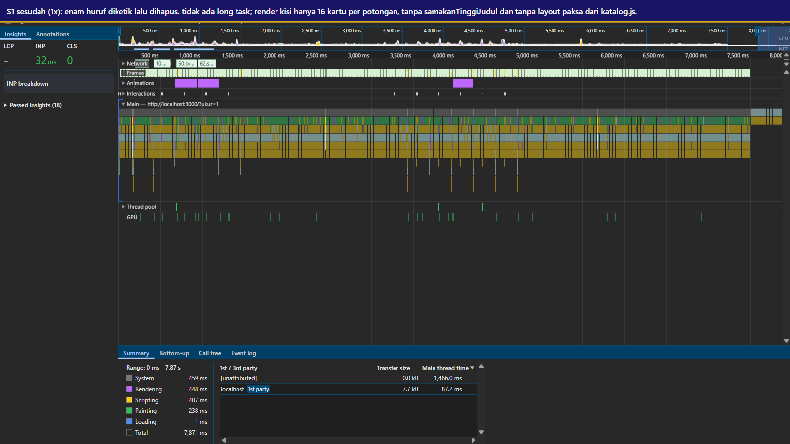

### T-03: perhitungan voucher "async" tetap memblokir satu task

- tiket terkait: TK-1057 (S4).
- gejala bagi pengguna: layar beku, progres terlihat "0%" lalu tiba-tiba selesai, guliran tidak jalan.
- bukti: trace sebelum-1x-s4 (gambar/fc-s4-sebelum.png): task klik 4.263 ms, 4.052 ms di antaranya satu blok Run microtasks tanpa frame; 0 frame menampilkan progres di ketiga putaran.

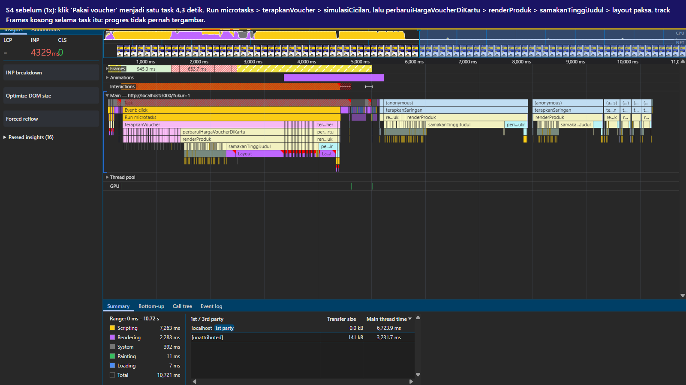

- akar masalah dan mekanismenya: hitungHargaPromo ditandai async tetapi tidak menunggu apa pun, jadi await hanya menjadwalkan microtask. antrean microtask dikuras habis sebelum browser boleh mengambil rendering opportunity, sehingga 3.000 iterasi berjalan tanpa kesempatan menggambar. 40 panggilan simulasiCicilan per produk dibuang hasilnya tetapi memakan sekitar 1 detik (microbenchmark). di akhir, render ulang kisi menambah 2,9 detik.
- kualitas yang terdampak: performance efficiency (time behaviour). interaction capability (self-descriptiveness: progres tidak menggambarkan keadaan sebenarnya sehingga pengguna mengira aplikasi crash; operability: guliran dan ketikan tertahan).
- perbaikan (P-03): 40 panggilan yang hasilnya tidak dipakai dihapus (aturan bisnis dan satu simulasi cicilan per produk tetap); loop dipecah per potongan sekitar 8 ms dengan scheduler.yield() atau setTimeout(0) di antaranya, jadi tiap potongan adalah task baru dan browser sempat menggambar serta memproses input; klik kedua ditolak selama perhitungan berjalan. render akhir ikut ringan berkat T-02.
- trade-off: total waktu perhitungan sedikit lebih panjang karena jeda antarpotongan; Web Worker dipertimbangkan tetapi setelah baris 40x dihapus perhitungan tinggal sekitar 40 ms, jadi biaya menyalin 3.000 produk ke worker tidak sepadan.
- hasil: INP S4 4.336 ms menjadi 24 ms (1x) dan 88 ms (4x); progres tampil di 5 frame; toast muncul 1,66 detik setelah klik (sebelumnya 8,9 detik). prediksi awal P-03 sendiri sempat meleset (hanya 1 frame progres) sampai render kisi diperbaiki di P-05.

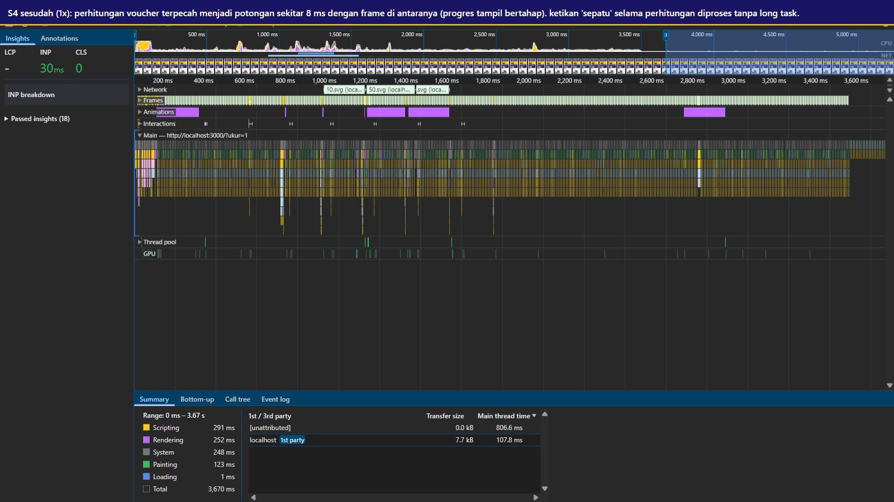

### T-04: "+ Keranjang" mengerjakan analitik 1,2 MB sebelum memberi umpan balik

- tiket terkait: TK-1044 (S2).
- gejala bagi pengguna: tombol tampak tidak bereaksi, pengguna menekan berulang dan isi keranjang bertambah lebih dari yang dimaksud.
- bukti: trace sebelum-1x-s2 (gambar/fc-s2-sebelum.png): task klik 194 ms; tambahKeKeranjang 87 ms, 72 ms di antaranya Lacak.kirim yang meng-hash payload berisi riwayat 9.000 entri.

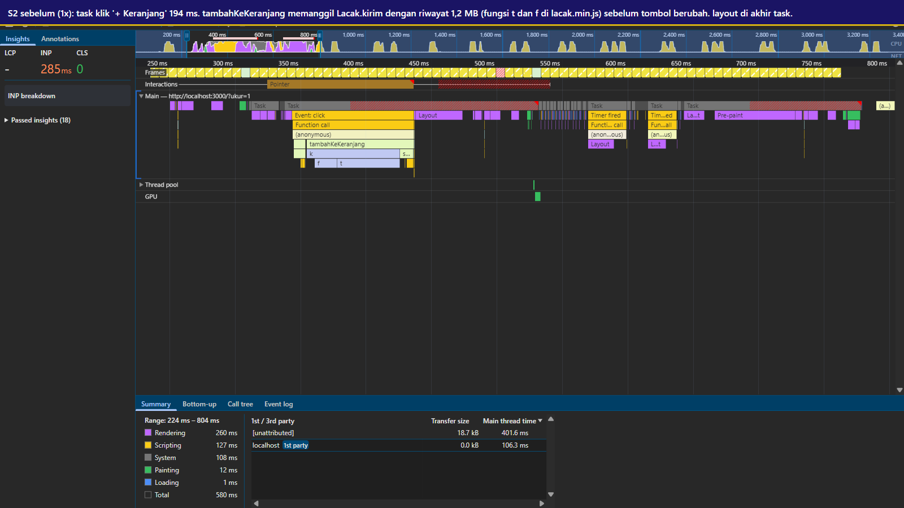

- akar masalah dan mekanismenya: urutan di handler adalah baca riwayat, kirim ke SDK (stringify dan hash 1,2 MB), simpan ke localStorage, baru mengubah tombol. perubahan tampilan baru bisa tergambar setelah task selesai. SDK sendiri mengulang hash fingerprint 2.000.000 kali di setiap panggilan (terbaca di lacak.min.js).
- kualitas yang terdampak: performance efficiency (time behaviour, resource utilization). interaction capability (self-descriptiveness: tidak ada tanda tombol bekerja; user error protection: ketukan ulang menambah barang tanpa sengaja).
- perbaikan (P-01, P-11, P-12): tombol dan lencana diubah lebih dulu; riwayat dibaca sekali saat idle dan disimpan saat idle; payload SDK dibuat ringkas tanpa riwayat; pencatatan riwayat dan SDK dijalankan di task terpisah setelah frame umpan balik. tanda centang di teks tombol dihapus karena glyph itu memicu pencarian font pengganti sekitar 76 ms pada ketukan pertama di 4x.
- trade-off: tim data kehilangan konteks riwayat di event add_to_cart; tombol kehilangan simbol centang, keberhasilan ditandai teks dan latar hijau.
- hasil: INP S2 200 ms menjadi 16 ms (1x) dan 48 ms (4x); long task S2 di 4x 0.

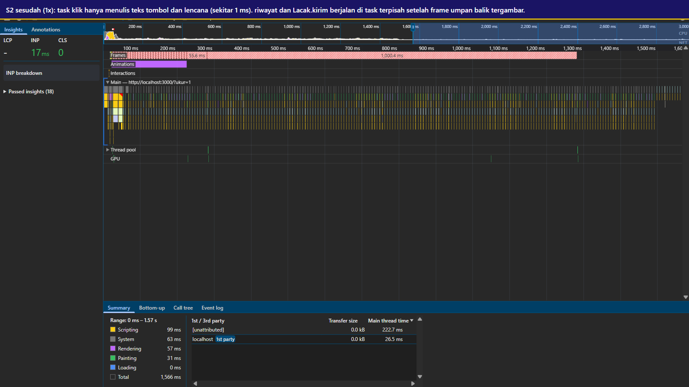

### T-05: "Beli sekarang" tidak mencegah pesanan ganda

- tiket terkait: TK-1052 (S3).
- gejala bagi pengguna: satu niat membeli menjadi tiga tagihan.
- bukti: tiga klik cepat menghasilkan 3 pesanan di log server pada ketiga putaran (laporan/hasil/sebelum-1x.json).
- akar masalah dan mekanismenya: task klik yang berat (pola T-04) membuat tombol diam, lalu setelah await fetch tombol tetap aktif tanpa penanda "sedang diproses". klik yang antre di antrean task input masing-masing memulai POST sendiri.
- kualitas yang terdampak: interaction capability (user error protection: sistem tidak mencegah kesalahan yang sangat mungkin terjadi; self-descriptiveness). di sisi bisnis, pesanan ganda harus di-refund.
- perbaikan (P-02): penjaga per produk, tombol diberi aria-disabled dan aria-busy dengan teks "Memproses pesanan", penanganan galat jaringan, dan penjaga tetap aktif selama tanda "Dipesan" tampil. uji click-through sempat menemukan pesanan kedua bila klik datang tepat setelah pesanan pertama selesai; celah itu ditutup di commit 4035e7c.
- trade-off: aria-disabled dipilih agar fokus keyboard tidak hilang, jadi penolakan klik bergantung pada penjaga JavaScript; idempotency key lebih kuat tetapi butuh perubahan server.
- hasil: 3 pesanan menjadi 1 di semua putaran, 1x dan 4x.

### T-06: listener gulir non-passive dan pemeriksaan 3.000 kartu per event

- tiket terkait: TK-1063 (S5), juga guliran yang tertahan di TK-1057.
- gejala bagi pengguna: guliran patah-patah.
- bukti: trace sebelum-1x-s5 (gambar/fc-s5-sebelum.png): periksaGulir 3.967 ms total selama 10 detik, 146 layout paksa, long task terpanjang 419 ms berisi listener wheel.

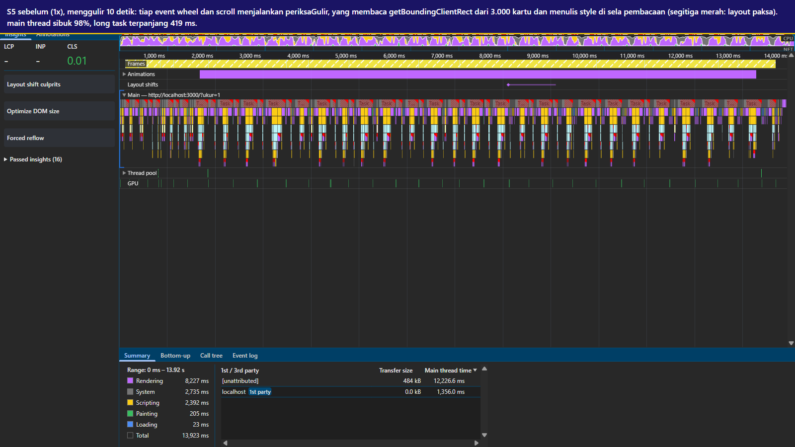

- akar masalah dan mekanismenya: touchmove dan wheel didaftarkan passive: false, jadi menurut MDN compositor harus menunggu main thread sebelum menggulir. periksaGulir dijalankan di tiga event sekaligus dan membaca getBoundingClientRect dari 3.000 kartu sambil menulis style. efek kartu muncul menganimasikan margin-top (properti layout).
- kualitas yang terdampak: performance efficiency (time behaviour). interaction capability (user engagement: guliran yang tersendat membuat halaman terasa murahan; operability).
- perbaikan (P-07): pull-to-refresh dicegah dengan overscroll-behavior-y, listener touch dan wheel dihapus; satu listener scroll passive digabung per frame; bar progres memakai transform; kartu muncul dan impresi dideteksi IntersectionObserver; efek muncul memakai transform dan opacity; impresi dikirim paling sering sekali per 5 detik (P-11).
- trade-off: impresi tiba di analitik sampai 5 detik lebih lambat; efek pantul di puncak halaman juga hilang.
- hasil: frame lebih dari 50 ms S5 28 menjadi 0 (1x) dan 5 (4x); long task terlama 346 ms menjadi 0 (1x) dan 53 ms (4x).

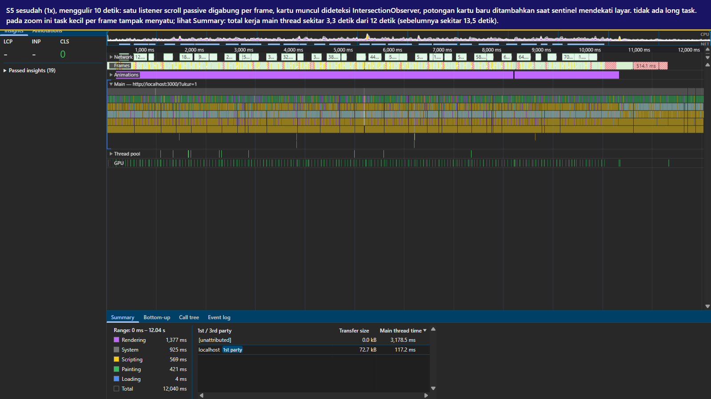

### T-07: 3.000 gambar diminta sekaligus

- tiket terkait: TK-1081 (S0).
- gejala bagi pengguna: kotak abu-abu lama, kuota cepat habis.
- bukti: 3.000 permintaan dalam 10 detik pertama, 322 selesai; gambar terakhir selesai di detik ke-94,7; sekitar 3,2 MB per muat (rata-rata 1.102 byte per SVG di trace).
- akar masalah dan mekanismenya: semua elemen img dibuat tanpa loading lazy. server meniru CDN dengan jeda 60 sampai 300 ms, dan menurut dokumentasi Chrome batas koneksi HTTP/1.1 ke satu host adalah 6, jadi antrean 3.000 / 6 x sekitar 180 ms kira-kira 90 detik, cocok dengan 94,7 detik yang terukur. setiap render ulang meminta ulang semuanya karena server mengirim no-store.
- kualitas yang terdampak: performance efficiency (resource utilization: kuota dan koneksi; capacity: antrean koneksi penuh). interaction capability (inclusivity: pengguna dengan kuota terbatas paling dirugikan; self-descriptiveness: kotak abu-abu tanpa keterangan).
- perbaikan (P-10, P-05): loading lazy dan decoding async, ukuran intrinsik 480 x 480, render bertahap, dan pemakaian ulang kartu. lazy loading sempat tidak berpengaruh karena atribut loading diisi setelah src; setelah urutannya dibalik (c421743), baru efektif.
- trade-off: saat digulir sangat cepat, gambar baru diminta ketika mendekati layar.
- hasil: 3.000 menjadi 8 permintaan dalam 10 detik pertama, semuanya selesai dalam 0,4 detik.

### T-08: banner promo menggeser kisi

- tiket terkait: TK-1078 (S0).
- gejala bagi pengguna: halaman melompat saat mau mengetuk produk teratas, yang terketuk malah banner.
- bukti: trace sebelum-1x-s0 (gambar/fc-s0-sebelum.png): layout shift tanpa input dengan skor 0,137 saat banner disisipkan; #alat turun dari y 451 ke 723.

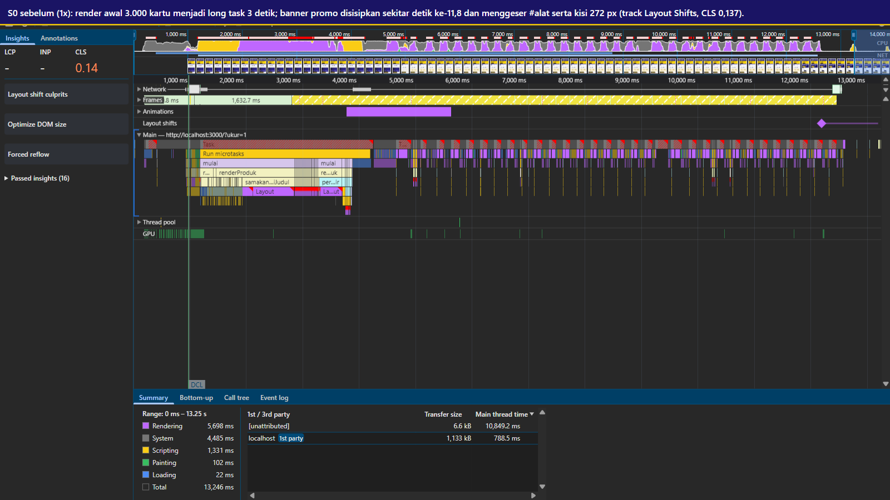

- akar masalah dan mekanismenya: banner disisipkan ke awal #utama setelah /api/promo menjawab (jeda server 1,8 detik, diproses di detik ke-8,4 karena main thread sibuk), tanpa ruang yang dicadangkan.
- kualitas yang terdampak: interaction capability (user error protection: ketukan mengenai elemen yang salah; operability).
- perbaikan (P-09): tempat banner ada sejak HTML dengan teks "Memuat promo 12.12…" dan pesan galat bila gagal; tinggi minimumnya diukur per breakpoint sehingga tinggi sebelum dan sesudah terisi sama di 24 lebar layar yang diuji; ukuran intrinsik gambar; efek muncul kartu memakai transform.
- trade-off: area banner berisi teks memuat selama sekitar 1,8 detik (gambar/01-banner-memuat.png).
- hasil: CLS 0,137 menjadi 0.

### T-09: alat ukur ikut menjadi beban pada ponsel lambat

- tiket terkait: TK-1070 dan TK-1063 pada 4x.
- temuan: requestAnimationFrame di public/alat/ukur.js memaksa main thread membuat frame di setiap vsync. pada 4x, halaman diam memakai 4.963 ms per 5 detik dengan ?ukur=1, tetapi hanya 291 ms tanpanya (sebelum animasi lencana dijeda). setiap animasi CSS yang aktif ikut dihitung ulang style-nya di frame-frame itu, begitu juga IntersectionObserver untuk setiap kartu yang masih diamati.
- tindakan: berkas alat ukur tidak boleh diubah, jadi jumlah pekerjaan per frame yang dikurangi: animasi lencana di luar layar dijeda, kartu non-kilat berhenti diamati setelah impresinya tercatat (P-08, P-11).
- makna untuk angka: sisa 55% main thread sibuk di S6 pada 4x sebagian besar adalah biaya mengukur, bukan biaya halaman bagi pengguna tanpa ?ukur=1.

## 5. dugaan yang ternyata keliru

| dugaan | sumber | yang terukur | kesimpulan |
|---|---|---|---|
| loop bersarang O(n²) di kategori.js adalah biang kerok utama | Rudi no. 1 | pasangKaki 1,2 ms selama render awal, sedangkan renderProduk 2.631 ms (trace sebelum-1x-s0); n hanya 8 kategori | keliru; kode tidak diubah |
| API produk lambat, perlu tambah server | Rudi no. 2 | /api/produk 199 ms, sedangkan render awal 2.652 ms; setelah perbaikan server yang sama melayani halaman tanpa long task pada 1x | keliru |
| bubble sort perlu diganti quicksort | Rudi no. 3 | urutkanGelembung di bawah resolusi sampling profiler; hanya mengurutkan 12 merek | keliru; kode tidak diubah |
| voucher sudah async, jadi tidak memblokir | Rudi no. 4 | satu blok Run microtasks 4.052 ms tanpa frame | keliru (lihat T-03) |
| SDK analitik agak berat | Rudi no. 5 | 13 sampai 15 ms per panggilan dengan payload kecil (microbenchmark), 72 ms dengan riwayat (trace S2 1x) | benar, tetapi beratnya bisa dikendalikan dari cara, waktu, dan isi pemanggilan tanpa menyentuh berkas SDK |
| tombol keranjang rusak | TK-1044 | tombol bekerja; umpan balik tertunda 194 ms di 1x | keliru, masalahnya urutan kerja |
| halaman sengaja loncat supaya iklan diklik | TK-1078 | pergeseran terjadi karena banner disisipkan belakangan | keliru |
| server lambat karena internet lancar untuk YouTube | TK-1081 | jeda per gambar memang dari server (60 sampai 300 ms), tetapi antrean 3.000 permintaan berasal dari klien; server yang sama melayani 8 gambar dalam 0,4 detik setelah perbaikan | sebagian benar |

## 6. yang belum beres dan rekomendasi

- S5 pada 4x masih 5 frame lebih dari 50 ms per 10 detik (target 2). di trace akhir-4x-s5, task di atas 40 ms berasal dari perbaruiTampilan yang membaca scrollHeight setelah kisi bertambah (layout paksa 22 sampai 29 ms) dan dari kiriman impresi ke SDK (44 ms). langkah berikutnya yang layak diukur: membaca tinggi dokumen di callback ResizeObserver, saat layout sudah bersih, alih-alih di requestAnimationFrame.
- untuk vendor SDK: fungsi fingerprint di lacak.min.js mengulang hash 2.000.000 kali di setiap panggilan dan tidak menyimpan hasilnya, sekitar 55 sampai 100 ms per panggilan pada 4x. hasil fingerprint sebaiknya dihitung sekali lalu disimpan.
- untuk tim backend: gambar dikirim dengan Cache-Control: no-store lewat HTTP/1.1. header cache yang wajar dan HTTP/2 akan mengurangi antrean saat pengguna menggulir jauh.
- untuk tim rekomendasi: riwayat di localStorage sudah 1,2 MB dan terus bertambah tanpa batas; perlu kesepakatan jumlah entri maksimum.
- untuk tim bisnis: harga voucher tidak dibulatkan ke ratusan (contoh Rp 76.208 di gambar/06-harga-voucher.png). ini perilaku aturan asli dan tidak kami ubah.
- pengukuran 4x hanya bisa dilakukan untuk versi sesudah perbaikan, jadi pasangan trace sebelum dan sesudah memakai 1x. kondisi ini disebut di bagian 2.
- perbaikan aksesibilitas di luar tiket, ditemukan saat uji click-through dan pemeriksaan tata letak: panel keranjang kini bisa ditutup dengan Escape dan fokus keyboard ikut berpindah (85fb6e3); fokus tidak lagi jatuh ke body setelah tombol "Ke atas" dipakai (937d811); target ketuk yang lebih kecil dari 44 px (tombol header 39 px, keping kategori 34 px, tautan logo 22 px) diperbesar sesuai WCAG 2.5.5 (commit terakhir di public/css/toko.css). setelah perubahan tinggi ini, tinggi banner sebelum dan sesudah terisi dicek ulang di 6 lebar layar dan tetap sama.
- verifikasi fungsi: laporan/bench/periksa-fungsi.js menjalankan 26 pemeriksaan klik dengan input asli pada viewport 412 x 915 (hasil di laporan/hasil/periksa-fungsi.json, tangkapan layar di laporan/gambar/01 sampai 09). semua lolos, tanpa galat konsol, dan ketujuh event SDK tetap terkirim.

## 7. pernyataan penggunaan AI dan pembagian kerja

alat AI yang dipakai dan untuk apa: ....

kontribusi tiap anggota: ....
